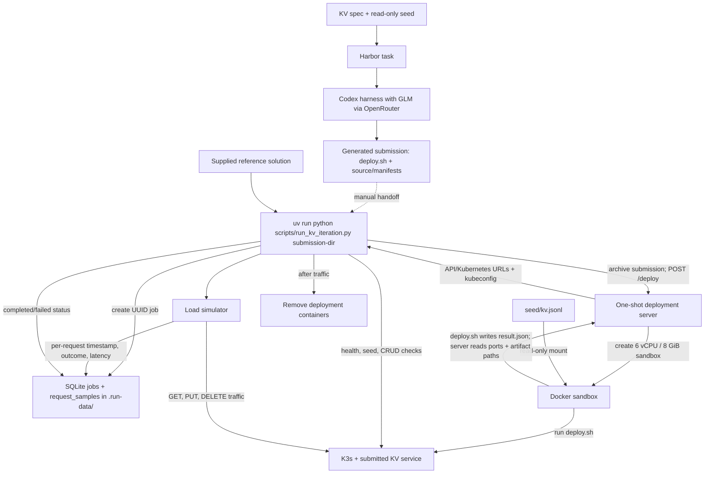

# loadsim

## Data flow

Harbor generates a submission, while the local runner measures a supplied
submission directory. Passing Harbor's output to the runner is a manual step
today.



## One local KV iteration

With Docker running, deploy the reference submission, run three five-second
GET/PUT/DELETE traffic phases, and save every scheduled request to SQLite:

```sh
uv run python scripts/run_kv_iteration.py ./solutions/KeyValueStore/solution
```

The script starts an isolated one-shot deployment server, mounts the supplied
`tasks/distributed-kv-k3s/environment/seed/kv.jsonl`, and checks that the
service imported it. It uses the returned API URL and kubeconfig, then removes
the deployment containers after traffic completes. The database and deployment
logs are kept under the ignored `.run-data/` directory. Each run prints its
job ID and a latency summary. `--rate`, `--duration`, `--max-in-flight`, and
`--timeout` adjust the traffic phases; `--database` selects another SQLite
file. The Docker daemon needs room for the 6 vCPU, 8 GiB deployment sandbox.

The first iteration covers baseline operations and latency. Fault injection,
overload scenarios, and CPU/memory measurements are later work.

A small Python library for steady traffic probes. It records the start time,
latency, and outcome of every scheduled call.

```python
import asyncio
import httpx

from loadsim import LoadSimClient

client = LoadSimClient(
    kubeconfig="/path/to/kubeconfig",
    kubernetes_url="https://cluster.example:6443",
    api_url="https://service.example",
)

async def main():
    async with httpx.AsyncClient(base_url=client.api_url) as http:
        async def request():
            response = await http.get("/healthz")
            response.raise_for_status()

        result = await client.atraffic(
            request,
            rate_per_sec=10,
            duration_s=60,
            max_in_flight=20,
            timeout_s=5,
        )
    print(result.average_latency_ms)
    result.save_jsonl("latencies.jsonl")

asyncio.run(main())
```

`rate_per_sec` is the total start rate, not a rate per worker. Calls are
scheduled evenly. `max_in_flight` caps simultaneous calls; a slot that arrives
while the cap is full is recorded as `dropped`, not queued. The operation must
be an async, no-argument callable. From synchronous code, use
`client.traffic(...)` instead of `await client.atraffic(...)`.

Each JSONL row has a UTC ISO timestamp, latency in milliseconds, sequence
number, and one of `success`, `error`, `timeout`, or `dropped`. Dropped calls
have no latency. The average includes all started calls, including errors and
timeouts, and returns `None` if none started. HTTP error responses count as
`success` unless the operation raises for them. The Kubernetes configuration
is stored on the client for later fault probes; this traffic probe does not
use it yet.

Run the tests with `python3 -m unittest discover -s tests`.
