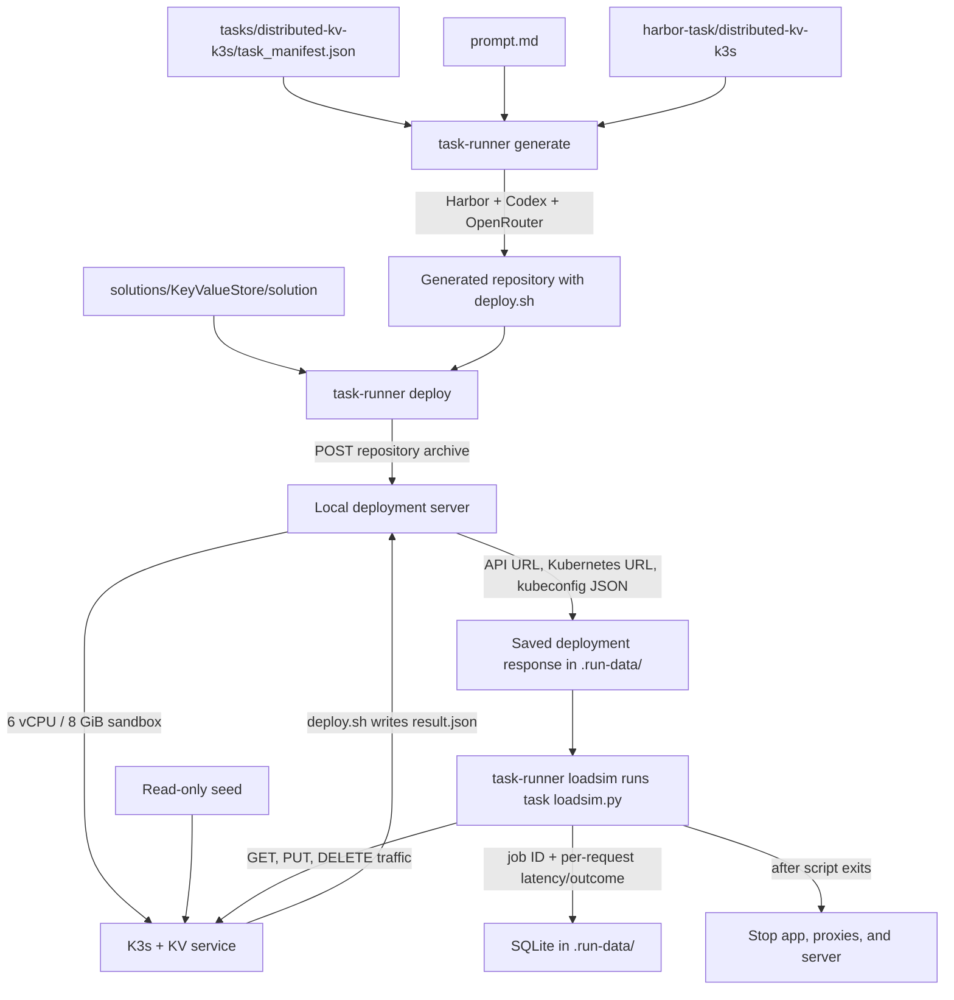

# System design task runner

Each task lives in `tasks/<name>/` with `task_manifest.json`, `prompt.md`, and
`loadsim.py`. The manifest points to a local reference solution in `solutions/`
and a Harbor task in `harbor-task/`. The task runner and loadsim run on this
machine; the deployment server starts a Docker sandbox limited to 6 vCPU and
8 GiB of RAM.

## Data flow



## Commands

From the repository root:

```sh
uv run python -m task_runner distributed-kv-k3s generate
uv run python -m task_runner distributed-kv-k3s deploy /path/to/generated/submission
uv run python -m task_runner distributed-kv-k3s loadsim
```

`generate` uses the model and Codex harness in the manifest. It requires a
gitignored `harbor-task/distributed-kv-k3s/.env` containing
`OPENROUTER_API_KEY=...`; `--model`, `--agent`, and `--env-file` override its
defaults. It prints the generated submission path. Harbor logs and generation
metadata stay under `.run-data/`. Harbor verification remains disabled because
the Harbor task's verifier is a placeholder; the generated submission is
evaluated by `deploy` and `loadsim`.

`deploy` accepts a directory containing `deploy.sh`. Omit the path to deploy
the reference solution from the manifest. It prints a job ID, saves the full
deployment server JSON response with private file permissions, and leaves the
service running. The seed is mounted read-only at `/seed/kv.jsonl`.

`loadsim` executes the task's Python script on this machine using the saved
JSON response. It checks seed import and basic CRUD behavior, then runs GET,
PUT, and DELETE phases. Samples and job status go directly to
`.run-data/task-runner.sqlite3`. It stops the deployment and server when the
script exits, including on failure. If multiple deployments are active, pass
`--job-id ID`. Options `--rate`, `--duration`, `--max-in-flight`, and
`--timeout` tune the traffic. Use `uv run python -m task_runner distributed-kv-k3s
cleanup ID` if a run was interrupted before loadsim.

Set `TASK_RUNNER_STATE_DIR` to keep job state and SQLite data in another
directory; its default is `.run-data/`.

The original `scripts/run_kv_iteration.py` remains available for existing
one-command runs and historical SQLite data. Fault injection and CPU/memory
measurements are later work.

Run unit tests with `uv run python -m unittest discover -s tests`. Run the
reference deployment and loadsim test against real Docker with
`RUN_DOCKER_SMOKE=1 uv run python -m unittest discover -s tests -p test_task_runner_docker.py`.
